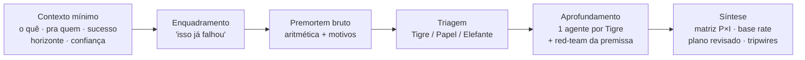

# premortem

**Imagine que já falhou. Descubra por quê — antes de gastar dinheiro, tempo ou reputação.**

Uma skill do Claude que roda um *premortem* sobre qualquer decisão de alto custo de erro. Assume que o plano já morreu num futuro próximo e trabalha de trás pra frente pra achar todo motivo que o matou. Um arquivo markdown. Sem servidor, sem dependência, sem estado externo.

[Instalar](#instalar) · [Como funciona](#como-funciona) · [Quando usar](#quando-usar) · [Exemplo](#exemplo) · [FAQ](#faq) · [Página](https://premortem-delta.vercel.app)

---

Um postmortem investiga por que algo morreu depois que morreu. O premortem faz o oposto: você imagina que já falhou e descobre por quê antes de começar.

O método é do psicólogo **Gary Klein**, publicado na *Harvard Business Review* (2007). **Daniel Kahneman** — Nobel, autor de *Rápido e Devagar* — chamou de sua técnica de decisão mais valiosa. A base cognitiva é mais antiga: Mitchell, Russo e Pennington mostraram em 1989 que imaginar um evento futuro como já ocorrido aumenta em ~30% a capacidade de apontar suas causas. Google, Goldman Sachs e Procter & Gamble usam antes de decisões grandes.

Feito pra quem decide sob alto custo de erro — fundador, criador, estrategista — e precisa ouvir o que não quer ouvir enquanto ainda dá pra mudar de rumo.

## O problema

Pergunte a um modelo de IA "esse plano é bom?" e ele vai atrás de razões pra confirmar. Pergunte "o que pode dar errado?" e ele responde cauteloso, genérico, hedge. Os dois caminhos protegem o plano em vez de testá-lo.

O custo aparece depois. A premissa que ninguém checou vira o motivo da falha — e você só descobre quando o dinheiro, o tempo e a reputação que estavam em jogo já foram gastos.

A virada: o premortem troca o tempo verbal. Você não pergunta "o que pode dar errado". Você afirma "isso deu errado" e pede a história. O cérebro entra em modo narrativo e gera motivos específicos, ancorados no plano real — não conselho genérico que serve pra qualquer coisa. Pesquisadores de Wharton e Cornell batizaram isso de **hindsight prospectivo**.

## Como funciona



A skill bate uma barra mínima de contexto, monta o enquadramento explícito "isso já falhou", roda a aritmética do plano (break-evens, metas que se contradizem) e gera todo motivo genuíno de falha. Depois tria cada motivo, vai fundo em cada ameaça real em paralelo, ataca a premissa central com um red-team, e fecha numa síntese com matriz Probabilidade × Impacto, base rate da classe de referência, plano revisado e tripwires datados. Entrega um relatório HTML + a transcrição completa.

| Sem premortem | Com premortem |
|---------------|---------------|
| "Esse plano é bom?" → o modelo acha razões pra dizer sim. Otimismo cordial. | "Isso já falhou, explique como" → o modelo para de justificar e passa a explicar o desmoronamento. |

A triagem separa o que merece energia do que só assusta:

- **Tigre** — ameaça real, com evidência. Ignorar seria negligência. Ganha urgência: Bloqueia-Lançamento, Fast-Follow ou Monitorar.
- **Tigre de Papel** — assusta no papel, mas é improvável ou gerenciável. Registra e segue.
- **Elefante** — o que todo mundo sabe e ninguém fala. Costuma ser gente, política ou ego — e é a causa real de falha com mais frequência do que parece.

## Quando usar

**Use quando:**
- Um produto, feature ou lançamento prestes a sair com dinheiro ou reputação em jogo
- Uma mudança de pricing ou de modelo de negócio
- Uma contratação prestes a acontecer
- Um pivô de estratégia ou posicionamento
- Qualquer compromisso onde errar custa caro e a decisão ainda pode mudar de rumo

**Não use quando:**
- A ideia ainda é vaga, sem plano concreto → planeje primeiro, depois rode o premortem
- A pergunta tem uma resposta certa → só responda
- É feedback de rascunho → isso é edição, não premortem
- A decisão já foi tomada e é irreversível → o premortem só serve enquanto dá pra mudar de rumo

## Exemplo

Brief: *"premortem disso: vou lançar um workshop ao vivo de R$1.500 sobre usar Claude pra times de marketing. 50 vagas. Alvo: gestores de marketing em empresas de 10-50 pessoas."*

O premortem bruto achou 6 motivos de falha. A triagem isolou três Tigres e um Elefante: a aprovação de orçamento que trava a compra, o comprador real que é o solo e não o gestor, a prep de 5 semanas vendida como 2, e a audiência que o criador *quer* ter em vez da que tem.

Síntese: a falha mais provável é o descasamento de audiência. A premissa oculta, do red-team: "gestor de empresa de 10-50" não se identifica assim nem frequenta os mesmos lugares. Base rate de audiência fria: 1-3%. Plano revisado, menor experimento primeiro: rode um piloto de R$197 pra 20 pessoas antes de travar o preço público de R$1.500. Tripwire: se em 7 dias menos de 10 inscritos forem gestores de time, o alvo está errado — pivota.

Passo a passo completo do método em [`skills/premortem/SKILL.md`](./skills/premortem/SKILL.md) e no [método canônico](./skills/premortem/references/metodo-canonico.md).

## Instalar

```bash
# Via skills CLI (recomendado)
npx skills add 1marcelserrano/premortem

# Ou manualmente — faça backup antes se a pasta já existir:
# mv ~/.claude/skills/premortem ~/.claude/skills/premortem.backup
git clone https://github.com/1marcelserrano/premortem.git
cp -r premortem/skills/premortem ~/.claude/skills/
```

**Verifique:** abra uma sessão nova do Claude e rode `/skills` (ou pergunte "que skills você tem?"). `premortem` deve aparecer. Se não, confira que `~/.claude/skills/premortem/SKILL.md` existe e reinicie a sessão.

**Sem terminal?** Baixe [`premortem.skill`](./premortem.skill) e suba no Claude (Cowork / claude.ai → Skills).

## FAQ

**Precisa de API key, conta paga ou servidor?** Não. É um arquivo markdown que o Claude carrega. Roda onde o Claude roda.

**Funciona sem sub-agentes?** Sim. Se o ambiente não tem sub-agentes, a skill roda cada aprofundamento inline, como passos analíticos independentes. O resultado é o mesmo; só a orquestração muda.

**Em que idioma ela trabalha?** Português. O corpo da skill e o relatório saem em pt-BR.

**Ela inventa números pra te assustar?** Não. Toda razão de falha precisa de evidência. Razão sem evidência desce pra Tigre de Papel — é o que separa ameaça real de ansiedade.

**É a mesma coisa que pedir "seja crítico"?** Não. Pedir crítica dispara hedge educado. O enquadramento "isso já morreu, explique como" é o mecanismo — é ele que destrava a identificação honesta de falha.

---

Uma skill do **[MSCREATIVE.SYSTEMS™](https://fronteirista.substack.com)**. Método: Gary Klein, *Performing a Project Pre-Mortem*, HBR (2007); hindsight prospectivo: Mitchell, Russo & Pennington (1989). Licença MIT — use, modifique, redistribua. Mantenha os créditos.
